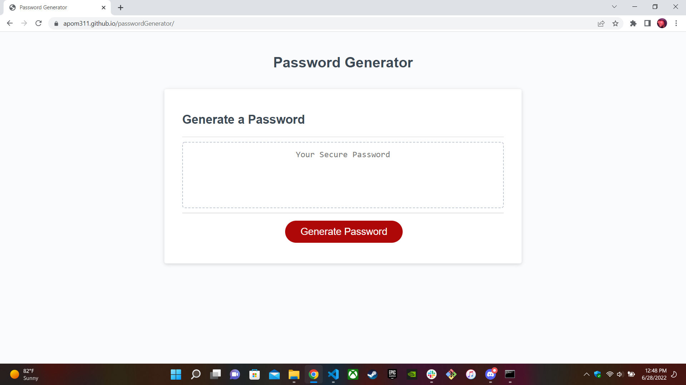

# passwordGenerator

given html & css files not touched from original

set new variables for all potential password characters

used 'concat' to combine potential characters into a new array as needed by user input which was determined by multiple if/else statements

set extra variables for potential characters to use when combining them into a shared array

added extra steps for when user input does not match requirements(or if no input was made whatsoever)

--bashed head against wall for an hour--

for loop used to set math function a number of times based on user input through given prompt and pushing aquired character into the finalChoice to use as password

moved the combinedChar variable inside the function to allow proper reset without refreshing the page every time

live webpage: https://apom311.github.io/passwordGenerator/

